# Tax Foundation Excel Bootcamp

This training course is designed for incoming interns, but can serve as a handy refresher for any person looking to up their Microsoft Excel game. For more and deeper info, check out [Microsoft's Excel help center][excel-docs]. For an hour-long presentation of Excel skills, see [this YouTube video](https://www.youtube.com/watch?v=0nbkaYsR94c).

## Table of Contents

* [What's the Goal of This Guide?](#what-s-the-goal-of-this-guide)
* [Getting to Know Excel](#getting-to-know-excel)
* [Using Basic Formulas and Functions](#using-basic-formulas-and-functions)
  * [Relative and Absolute References](#relative-and-absolute-references)
* [Organizing Messy Data](#organizing-messy-data)
  * [Text to columns to Separate Conjoined Values](#text-to-columns-to-separate-conjoined-values)
  * [Number Formats to Enhance Presentation and Prevent Weird Errors](#number-formats-to-enhance-presentation-and-prevent-weird-errors)
  * [Advanced Sorting to Arrange Things How You Want Them](#advanced-sorting-to-arrange-things-how-you-want-them)
  * [Transposition to Flip Everything Around](#transposition-to-flip-everything-around)
  * [Text Functions to Find, Extract, and Manipulate Text](#text-functions-to-find-extract-and-manipulate-text)
* [Using Advanced Formulas](#using-advanced-formulas)
  * [Using VLOOKUP to Match Data from Different Tables](#using-vlookup-to-match-data-from-different-tables)
  * [Using IF and Other Logical Functions to Compare Data](#using-if-and-other-logical-functions-to-compare-data)
* [PivotTables to Summarize and Organize Data](#pivottables-to-summarize-and-organize-data)
  * [Create Your First PivotTable](#create-your-first-pivottable)
  * [Choosing What Your PivotTable Displays](#choosing-what-your-pivottable-displays)
  * [Filtering by Criteria](#filtering-by-criteria)
* [File > Save As](#file--save-as)
  * [XLSX](#xlsx)
  * [CSV](#csv)

## What's the Goal of This Guide?

People come to the Tax Foundation with all sorts of backgrounds and varying levels of experience. Not everyone is an Excel whiz. This guide is meant to go over the most commonly used Excel features for managing the datasets we work with.

### There is a Wrong Way and a Right Way to Excel

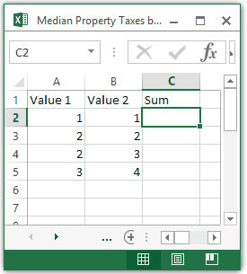

There are many ways to complete tasks in Excel, but some are better than others. Many tasks can be done through monotonous repetition. However, choosing this path wastes your time and crushes your soul. It's much better to invest some time upfront to learn about Excel features that will speed up your work and automate repetitive tasks.

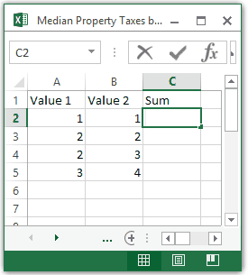

## Getting to Know Excel

First things first: let's learn how to find our way in Excel. All Excel spreadsheets are made of columns and rows, represented with letters and numbers respectively. The intersection of a column and row is a cell.

You can select a single cell by clicking it. You can move your selection around with the arrow keys, page up/down, and home/end. Select multiple cells by clicking and dragging, or by holding `Shift` and you move your selection.

To change the contents of a selected cell, just start typing. If you're entering a formula, be sure to start with `=`. When you're done editing a cell, hit `Enter` to accept and move down one cell, or `Tab` to accept and move right one cell. To delete the contents of a cell, just hit `Delete`.

You can select and entire column or row by clicking on its letter or number respectively. To select everything, hit `Ctrl A`. To delete an entire column or row (not just empty the cells of data, but completely remove the cells), hit `Ctrl -`.

You can copy individual cells or selections of cells with `Ctrl C` and paste them elsewhere with `Ctrl V`.

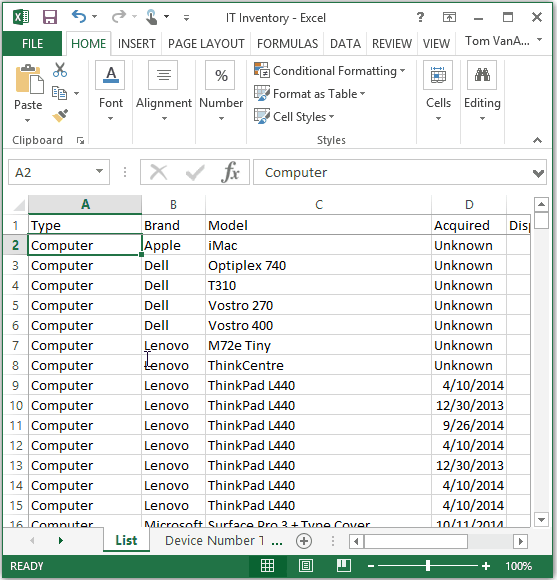

## Using Basic Formulas and Functions

[Once upon a time, spreadsheets were the most tedious thing in the world.][tedium] If you had rows and rows of data to add, you had to manually go through them and add the values. And if someone says, "Make a change to this data", you had to do it all again! Thankfully, Excel lets us write formulas that calculate for us and update based on changes to our data. Let's cover the basics.

| Formula | What It Returns |
| --- | --- |
| `=SUM(Value1, Value2, ...)` or `=Value1+Value2+...` | Returns the sum of cells, values, or ranges. [See documentation.][sum]|
| `=Value1-Value2-...` | Returns the difference between cells or values. [See documentation.][subtract] |
| `=Value1*Value2*...` | Returns the product of cells or values. [See documentation][basic-formula] |
| `=Value1/Value2/...` | Returns the quotient of cells or values. [See documentation][basic-formula] |
| `=AVERAGE(Values)` | Average of the values, cells, or ranges passed. [See documentation.][average] |
| `=MEDIAN(Values)` | Returns the median of the values, cells, or ranges passed. |
| `=MAX(Values)` | Maximum value of the values, cells, or ranges passed. |
| `=MIN(Values)` | Minimum value of the values, cells, or ranges passed. |
| `=COUNT(Values)` | Returns the number of cells that are numbers within the cell range given. E.g., if `A1` is 4 and `A2` is "potato" and `A3` is empty, then `=COUNT(A1:A3)` returns 1. Number as text, e.g., `"1"`, also count. [See documentation.][count] |
| `=COUNTA(Values)` | Returns the number of cells in the range of values which aren't empty. [See documentation.][counta] |
| `=Value1&Value2` | Returns the concatenation of values, e.g., `="Fizz"&"Buzz"` returns "FizzBuzz". |

There are four ways you might specify the values passed to an Excel function:

* Include the value in the function, e.g., `=SUM(2, 2)` = 4
* Pass cell references to the function, e.g., `=SUM(A1, B1)` = the sum of the values in cells A1 and B1.
* Pass a cell range into the function, e.g., `=SUM(A1:A50)` = the sum of all numbers in column A, rows 1 through 50 inclusive.
* Pass the results of another function into the function, e.g., `=SUM(AVERAGE(A1:A50),AVERAGE(B1:B50))` = the sum of the averages of columns A and B, rows 1 through 50 inclusive.

### Relative and Absolute References

To use the value of a given cell in a formula, you reference it with the letter and number of it's column and row. If I write  in cell C1 the formula `=SUM(A1, B1)`, I'm telling Excel to add the values in the cell at column A, row 1, and column B, row 1, and to display the result in C1.

If you have many rows of values in columns A and B, you may want to sum all of them. It would be madness to rewrite the preceding formula in every row. This is where relative references come in. You can easily expand this formula by clicking and dragging the bottom-right corner of the selected cell. Or you can expand all the way down column C, until your rows stop, by double-clicking the botoom-right corner of the selected cell. When you do this, Excel knows to change `=SUM(A1, B1)` into `=SUM(A2, B2)`, `=SUM(A3, B3)`, etc.

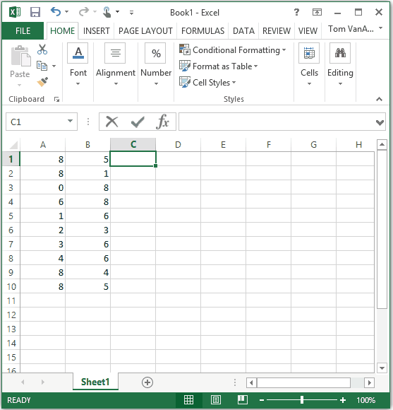

Excel's relative references make some tasks much easier, but can easily break others. Let's say you need to multiply every number in column A by the value of B1. With relative cell references, expanding your formula would fail. B1 would become B2, and the results wouldn't be what you wanted. To force Excel to use a specific, or *absolute*, cell, you can prefix the column or row with `$`. Excel will not automatically change the value after the `$` in a formula that is copied to other cells.

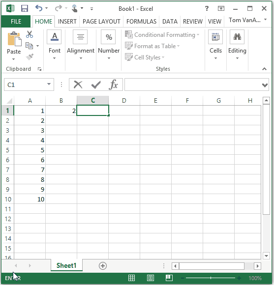

## Organizing Messy Data

When compiling data for analysis, you'll be drawing from many different sources. Each source has their own preferred way of formatting data. Data will be arranged differently, saved in different formats, or even (*gasp!*) saved as a PDF. Your first job will be to reform datasets into something you can use.

### Text To Columns to Separate Conjoined Values

Sometimes you'll get a dataset that's in an unusual text format. It may be a CSV file saved as a `.txt` file. Or maybe your data has a column for "County, State" and you want to separate them into "County" and "State". In these situations, Excel's Text to Columns features will be very useful.

Let's work through the example of breaking out county and state names. You would select the entire column (click the letter for that column to select the whole thing), then go to `Data > Data Tools > Text to Columns`. A dialog box will pop up to walk you through this.

First, you'll want to acknowledge that your data is [delimited][delimited], which means that there is a uniform system for separating the units of data in your set. (Your data *could* be fixed width, but this isn't very likely.) This could be spaces, commas, tabs, pipes, or any other kind of delimiter. Go to the next screen and specify which delimiter your data uses. If it's something weird and custom, you can specify that with `Other`. On the final screen, you can preview the new columns you're about to create and specify data formats. When you're ready, click `Finish` to create your new columns.

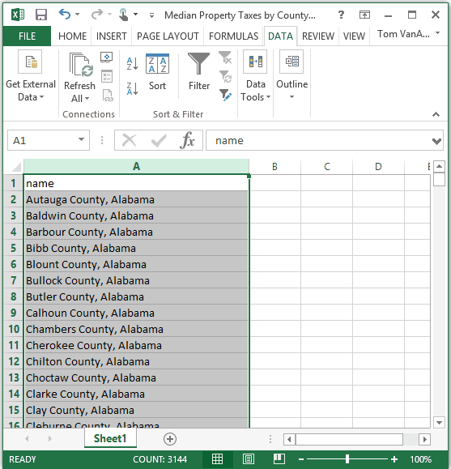

The observant among you will say, "Wait a minute! Now every state name has a space in front of it!" Yes, you're correct! Let's fix that.

You can quickly remove the leading spaces from data with the `TRIM` function. In the next column, trim the first state name and then copy that function all the way down. Then just copy that corrected column, paste the values over the original, and delete your unnecessary column.

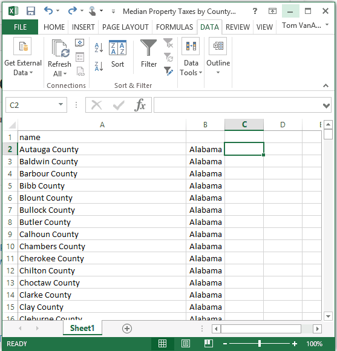

### Number Formats to Enhance Presentation and Prevent Weird Errors

Excel includes a feature to format data according to commonly used conventions, such as currency, percentages, and dates. Sometimes these formats are handy, and sometimes they are maddening.

The right format to use is dependent on your data and the context you will use it in. For example, you would format a summary data table in a blog post for human readability. But for performing calculations, that formatting would be unacceptable.

#### Sample Blog Table

| State | Dollars | Percents |
|:--- | ---:| ---:|
| Alabama | $326.04 | 14% |
| Wyoming | $297.45 | 9% |

#### Sample Raw Dataset

```
state,dollars,percents
Alabama,326.04,0.14
Wyoming,297.45,0.09
```
#### Warning

Some formats can cause problems when saving the underlying data. For example, the default format is "General". Under General format, very large or very small numbers are sometimes displayed with scientific notation, e.g., 5.32 x 10<sup>7</sup>. [If you saved this file as a CSV](#file-save-as), you would unintentionally save the scientific notation rather than the underlying data! If someone used that CSV file to perform calculations, their program may not be able to correctly read the data. Always be careful to remove inappropriate formatting from final CSV files.

### Advanced Sorting to Arrange Things How You Want Them

The order your data comes in is now always the order it needs to be in. Sorting is pretty straightforward: select your data, then go to `Data > Sort and Filter > Sort`. Here you can define your custom sorts. Your can define multiple levels of sorting. For example, if you wanted to sort county-level tax collections alphabetically by state and then by tax collections large-to-small, you could add a first sorting level of state, sorted A to Z by values, and a second level of tax collections, sorted largest to smallest by values. There are many ways you may want to sort data, and it's worth playing around with it.

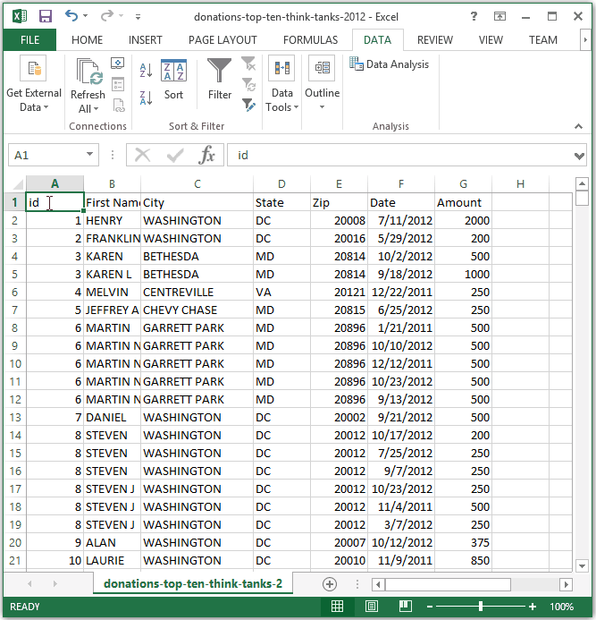

Sometimes you'll have data where the columns are arranged in a way you don't want. In this case, you can also custom sort columns as well as rows. To do this, select the columns you want to sort and, in the sort menu, choose `Options > Sort left to right`.

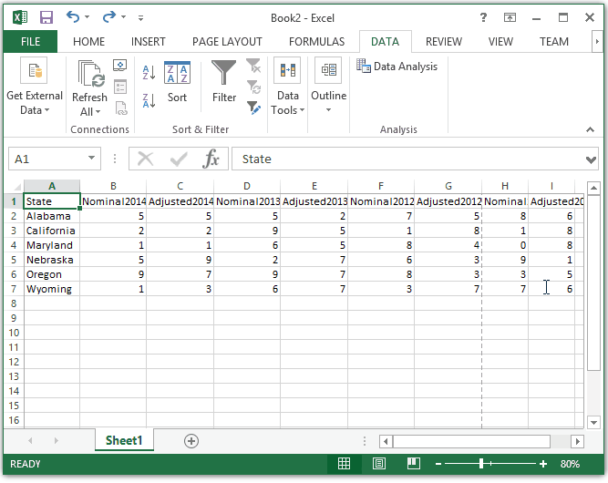

### Transposition to Flip Everything Around

You may get a dataset where you need to swap, or *transpose* the axes. This is pretty easy:

* Copy all of your data
* Choose a location to paste the transposed data
* Right-click into the desired first cell, choose `Paste Options > Transpose (T)`


## Text Functions to Find, Extract, and Manipulate Text

You may have data that contains text which isn't quite ready for you to use. With Excel's [text functions][text-functions], you can work with this text to get it into the condition you require. A few handy examples:

Function | Description | Example
--- | --- | ---
`SEARCH([Text to find], [Text to search])` | Returns the start position of text within text, or `#VALUE` error. Case insensitive. | `=SEARCH("a", "123abc")` returns 4.
`LEN("Text")` | Returns the length of a piece of text. | `=LEN("Example")` returns 6.
`LEFT("Text", Number)` | Returns the number of characters in a text starting from the left. (`RIGHT` is the same, but starts at the right side.) | `=LEFT("foobar", 3)` returns "foo".
`SUBSTITUTE([Text to alter], [Old text], [New Text])` | Replaces a piece of text within a larger text with a substitution. (See also, `REPLACE`.) | `=SUBSTITUTE("foobar", "bar", "cat")` returns "foocat".
`TEXT([Value to convert to text], [Optional format code])` | Converts a value, like a number, to text. | `=TEXT(1234,"0000000")` returns "0001234".
`TRIM(" Text ")` | Remove all leading and trailing spaces from text. | `=TRIM("   stuff   ")` returns "stuff".

## Using Advanced Formulas

Now that you've got the easy bits under your belt, let's make some *really* interesting formulas! Excel formulas allow for a lot of programmatic logic to make [data munging][wrangling] much easier. Let's look at some of the most useful formulas.

### Using VLOOKUP to Match Data from Different Tables

**VLOOKUP** is a useful function for finding a value from one table based on a value in another table.

For example, let's say you have a table of state-level data where the states are identified by [FIPS code][fips]. You want the data to be identified by the full state name instead. Luckily, you've got a table that matches FIPS codes to full state names. Should you use that table as a reference, manually replacing FIPS codes in your data set with state names? No, never! We'll use VLOOKUP to to match the full state name to the FIPS code.

#### Example Data

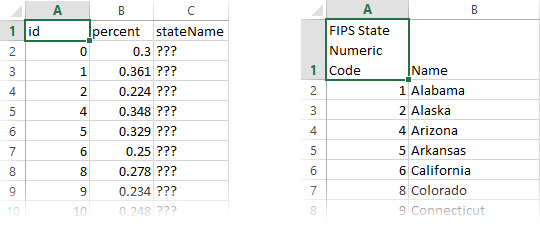

#### Writing Your VLOOKUP

The VLOOKUP formula has four parts:

1. A reference to the cell whose value you're looking to match.
2. A reference to the table you're matching that cell against.
3. The column number you want to retrieve from that table.
4. Whether or not a close, but not exact, match is acceptable. (Hint: This should always be set to FALSE for our purposes.)

The final formula in our example might look like this:


Some important things to note:

* The first value is a relative cell reference to `A2`. When you copy this formula down through the column, it will automatically update to look for `A3`, `A4`, etc.
* The second value is an absolute table reference. The `$` before the letter and number tell Excel to keep these values exactly the same when this formula is copied. This way, cells `C2:C51` will always be looking for values in the precise location of the reference table, `Sheet2!$A$2:$B$52`. If you don't make this reference absolute, you'll end up looking for the value in `C51` in a table of mostly empty cells!
* Column numbers for part three begin at 1 and count up.
* The values we're searching through in the second table are sorted in ascending order, and the value we're looking for is in the first column. This is necessary with VLOOKUP.
* The data we want to modify does not include the District of Columbia, but the FIPS reference table does. It's OK if something in the reference table doesn't have a match in the table where we're using VLOOKUP. The opposite situation--a value in our data that doesn't exist in the reference table--will throw the `#N/A` error.

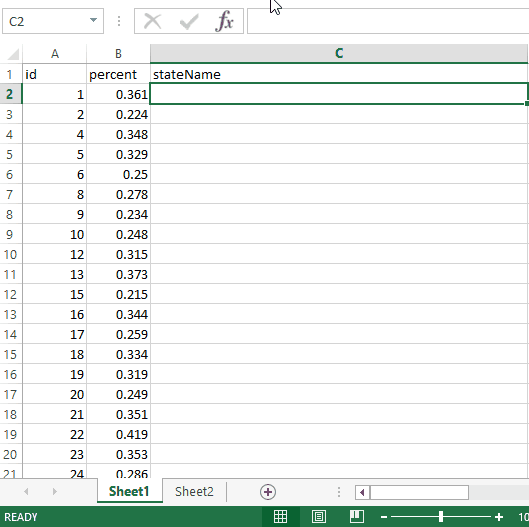

## Using IF and Other Logical Functions to Compare Data

Excel has several [logical functions][logical-functions] that let you compare values and return specific data depending on the result of the comparisons.

### IF Function

Using a formula like [IF][if] lets you introduce conditional logic into your data. Let's see an example:

`=IF(A1 = "Super", "Duper", "Fail")`

In the above example, the formula checks cell A1 for the string "Super". If A1 equals "Super", then the formula displays "Duper". Otherwise, it displays the string "Fail".

`IF` statements can be nested to create complex Excel formulas. For example

Combining `IF` with `VLOOKUP` lets us do things like handle errors gracefully. As stated previously, if `VLOOKUP` doesn't find a match in the reference table, it will throw an error. Instead of seeing this error, we may want our dataset to use the string "No Data". To do this, we could write a function as follows:

`=IF(ISNA(VLOOKUP(A1,Sheet2!A1:B3,2,FALSE),"No Data",VLOOKUP(A1,Sheet2!A1:B3,2,FALSE)))`

This function would first see if the result of the `VLOOKUP` returns the `#N/A` error. If so, it returns the string "No Data". Otherwise, if the `VLOOKUP` is valid, it returns the result of the `VLOOKUP`.

### AND and OR

You can get `TRUE` and `FALSE` values from multiple condition evaluations by using the `AND` and `OR` functions.

For `AND` to be `TRUE`, all comparisons in the function must individually evaluate as `TRUE`. For `OR` to be `TRUE`, *at least one* comparison in the functiion must individually evaluate as `TRUE`.

For example, with the given data:

|     | `A` | `B` |
| --- | --- | --- |
| `1` | 6   | 2   |
| `2` | 5   | 12  |


`=AND(A1>10,B1>10)` is `FALSE` and `=AND(A1>1,B2<10)` is `TRUE`

`=OR(A1>10,B1>10)` is `FALSE` and `=OR(A1>1,A2>10)` is `TRUE`

### NOT

The `NOT` function is an easy way to reverse a boolen (`TRUE` or `FALSE`) value. So `=NOT(TRUE)` evaluates to `FALSE`. Or `=NOT(AND(1>2, 2>0))` evaluates to `TRUE`.

### COUNTIF, COUNTIFS, SUMIF, SUMIFS

Excel has advanced `IF` functions for summing, counting, etc, based on single or multiple criteria. Among the most useful are [COUNTIF][countif], [COUNTIFS][countifs], [SUMIF][sumif], and [SUMIFS][sumifs].

`COUNTIF` and `SUMIF` will perform `COUNT` or `SUM` on a range of data that meet a single criterion. For example.

|     | `A`      | `B`      |
| --- | -------- | -------- |
| `1` | 321      | "banana" |
| `2` | 12       | "kiwi"   |
| `3` | 4        | "banana" |

`=COUNTIF(B1:B3,"banana")` evaluates to `2`, the count of cells in the range equal to "banana".
`=SUMIF(A1:A3,">10")` evaluates to `333`, the sum of `A1` and `A2` but not `A3` which was less than 10.
`=SUMIF(B1:B3,"banana",A1:A3)` evaluates to `325`. The first range of cells is the range to check the criteria against, and the second range of cells is the range to add if the criteria is `TRUE`. So where the cell in `B1:B3` is "banana", `SUM` the cell in column `A` in the same row.

`COUNTIFS` and `SUMIFS` are similar, but they accept multiple criteria. Example:

|     | `A` | `B` | `C` |
| --- | --- | --- | --- |
| `1` | 11  | 92  | 501 |
| `2` | 18  | 22  | 679 |
| `3` | 12  | 42  | 342 |

`=COUNTIFS(A1:A3,">15",B1:B3,">20")` evaluates to `1`, as only one row (row 2) satisfies both criteria.

`=SUMIFS(A1:A3,B1:B3,">40",C1:C3,"<500")` evaluates to `12`, as only `A3` is summed because that's the only row meeting criteria (`B` greater than `40` and `C` less than `500`).


## PivotTables to Summarize and Organize Data

PivotTables are a very cool Excel feature that allows you to create summary tables of your data. For example, let's say you have a dataset that lists tax collections at the county level and you want to know the sum of collections at the state level. You could devise a series of formulas to get this information, but it's much easier to quickly build a PivotTable. Let's dig into it!

### Create Your First PivotTable

1. Select all of the data you intend to summarize.
2. Go to `Insert > Tables > PivotTable`
3. By default, PivotTables are created on new worksheets. The default settings are usually fine, so go ahead and click `OK` to create your PivotTable.

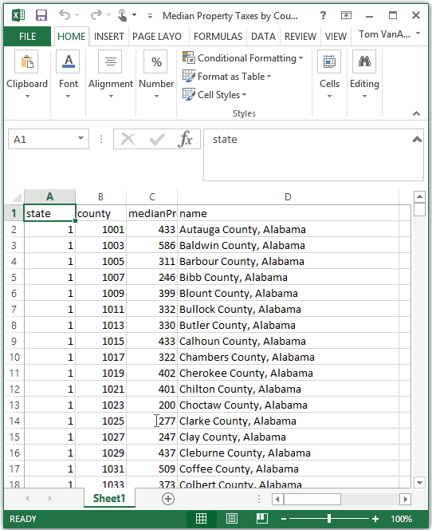

### Choosing What Your PivotTable Displays

A blank PivotTable isn't much help. You need to select which fields you want to summarize and how. In our example of summarizing count tax collections by state, we want to choose state for our rows and the taxes as our values. We can easily drag our chosen fields into the sections we want them using the PivotTable pane.

By default, the number in Values will be a count summary. We don't need to know how many counties are in each state! For our example, we select the Value and choose `Value Field Settings...` to change from `Count` to `Sum`. We also change the number format to `Currency`, since we know we're working with dollar values.

There are many ways to summarize and format data values, and the correct one will vary from project to project. Don't be afraid to play around with it and see what you can do!

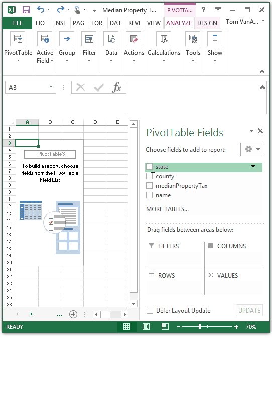

### Filtering by Criteria

Sometimes you'll want to filter the PivotTable results. You can easily do this by dragging-and-dropping the field you want to filter by into `FILTERS` in the PivotTable pane. This will add the field to a list of filters above the PivotTable, where you can fine-tune the criteria to filter by.

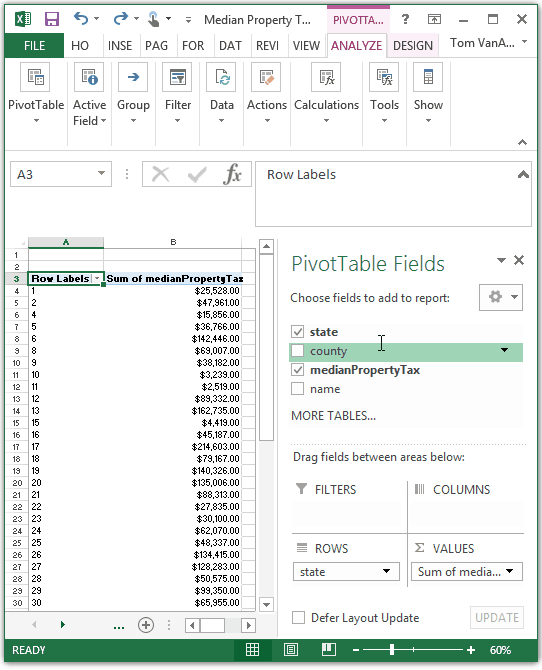

## File > Save As

Truthfully, you should've been saving your work as you went along! There's no telling when Excel might crash, destroying all of your hard work.

But this section isn't just a reminder to save! Now that you've wrangled your data, you need to make sure it's in a ready-to-use file format. You'll typically be working with two formats: **Excel** and **CSV**. Here's what you need to know about each.

### XLSX

The default file used by Excel is the **XLSX** file. This filetype is best for preserving constructs that help you clean your data, such as formulas and PivotTables. **Using XLSX is best while the data you're cleaning is a work-in-progress.**

### CSV

In almost all cases, you're saving the final file as a **comma separated values** file, or **CSV**. You will save the final CSV files separate from the WIP Excel files you used previously.

A CSV is exactly what the name implies: values with commas in between, and line-breaks between rows. **This is the preferred format for final individual data tables** because it strips out all of Excel's magic and leaves an easy-to-use, platform-agnostic dataset. No formulas, no PivotTables, no number formats, no font formats, not even separate worksheets. CSV is clean and simple.

#### Example CSV File

```
id,value,percent
1,347.05,0.14
2,937.56,0.32
```

#### Saving As CSV

In Excel, go to `File > Save As` and choose `CSV (Comma Delimitted)` as the file type.

Because saving as CSV means losing all of the special Excel magic in the file, Excel will warn you about saving CSVs every single time. Be patient, and tell it, yes, you really, truly do want to save as CSV.

[excel-docs]: https://support.office.com/en-us/excel
[tedium]: https://medium.com/backchannel/a-spreadsheet-way-of-knowledge-8de60af7146e
[sum]: https://support.office.com/en-us/article/SUM-function-043e1c7d-7726-4e80-8f32-07b23e057f89
[subtract]: https://support.office.com/en-us/article/Subtract-numbers-938b7912-5699-4609-969b-38b23ca00d54
[basic-formula]: https://support.office.com/en-us/article/Use-Excel-as-your-calculator-a1abc057-ed11-443a-a635-68216555ad0a
[average]: https://support.office.com/en-us/article/AVERAGE-function-047bac88-d466-426c-a32b-8f33eb960cf6
[count]: https://support.office.com/en-us/article/COUNT-function-a59cd7fc-b623-4d93-87a4-d23bf411294c
[counta]: https://support.office.com/en-us/article/COUNTA-function-7dc98875-d5c1-46f1-9a82-53f3219e2509?ui=en-US&rs=en-US&ad=US
[delimited]: http://en.wikipedia.org/wiki/Delimiter-separated_values
[text-functions]: https://support.office.com/en-us/article/Text-functions-reference-cccd86ad-547d-4ea9-a065-7bb697c2a56e?ui=en-US&rs=en-US&ad=US
[wrangling]: https://en.wikipedia.org/wiki/Data_wrangling
[fips]: https://www.census.gov/geo/reference/ansi_statetables.html
[logical-functions]: https://support.office.com/en-us/article/Logical-functions-reference-e093c192-278b-43f6-8c3a-b6ce299931f5?ui=en-US&rs=en-US&ad=US
[if]: https://support.office.com/en-us/article/IF-function-69aed7c9-4e8a-4755-a9bc-aa8bbff73be2?ui=en-US&rs=en-US&ad=US
[countif]: https://support.office.com/en-us/article/COUNTIF-function-e0de10c6-f885-4e71-abb4-1f464816df34?ui=en-US&rs=en-US&ad=US
[countifs]: https://support.office.com/en-us/article/COUNTIFS-function-dda3dc6e-f74e-4aee-88bc-aa8c2a866842?ui=en-US&rs=en-US&ad=US
[sumif]: https://support.office.com/en-us/article/SUMIF-function-169b8c99-c05c-4483-a712-1697a653039b?ui=en-US&rs=en-US&ad=US
[sumifs]: https://support.office.com/en-us/article/SUMIFS-function-c9e748f5-7ea7-455d-9406-611cebce642b?ui=en-US&rs=en-US&ad=US
